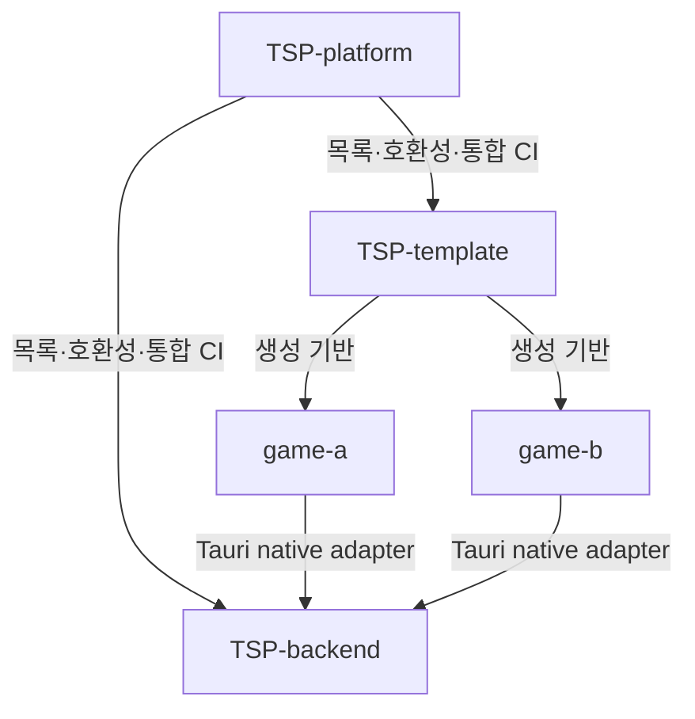

# 아키텍처

## 저장소 관계

`TSP-platform`은 런타임 의존성이 아닙니다. 배포되는 게임이나 백엔드 바이너리에 포함되지 않으며 저장소 간 운영 계약만 관리합니다.

## 책임

### TSP-platform

- 저장소 목록과 호환 버전 선언
- 개발 작업공간 bootstrap
- 공개 계약의 교차 저장소 통합 확인
- 전체 아키텍처와 저장소 운영 정책

### TSP-template

- Tauri, SolidJS, Phaser 기반 계약
- 브라우저·데스크톱·모바일 품질 게이트
- 게임이 구현할 포트와 네이티브 어댑터 경계

### TSP-backend

- REST와 WebSocket 공개 계약
- 인증, 권한, `game_id` 격리
- 서버 데이터와 운영 구성

### 게임 저장소

- 게임 규칙, 콘텐츠, UI, 에셋과 저장 스키마
- 선택한 template ref와 backend protocol version
- Tauri 네이티브 백엔드 어댑터와 게임별 배포

## 통신 경계

게임의 SolidJS와 Phaser 코드는 `TSP-backend`에 직접 연결하지 않습니다. 게임이 정의한 타입 기반 포트를 Tauri 네이티브 어댑터가 구현하고, 네이티브 계층이 HTTP와 WebSocket 수명주기를 소유합니다.

상위 통합 CI는 이 경계를 대체하지 않습니다. 현재는 백엔드 진단 endpoint를 실제 프로세스에서 확인하고, 네이티브 어댑터가 생기면 같은 공개 계약을 통해 클라이언트 왕복 검사를 추가합니다.
